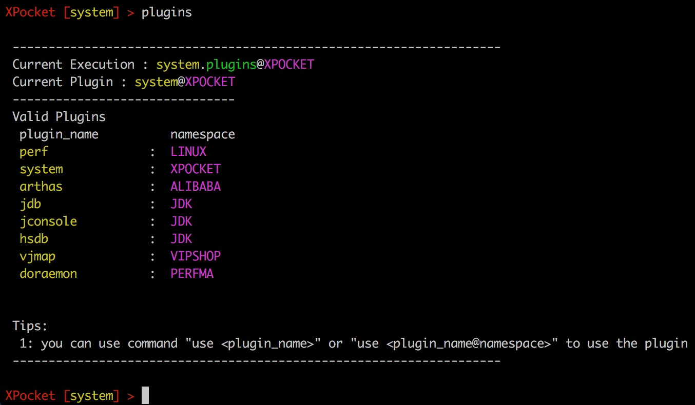
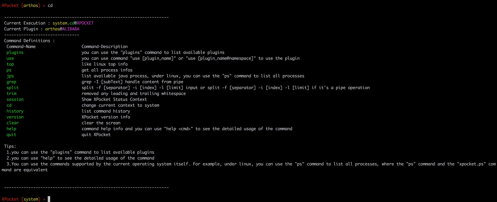

## XPocket


`XPocket` 是PerfMa开源的一套工具整合方案，集合了多个优秀的开源工具，现阶段主要侧重性能领域，工具之间可以相互配合的进行工作，开发人员也可以快速的开发属于自己的插件。

当你遇到以下类似问题时，`XPocket`可以帮助到你：
1. 系统存在性能问题？
2. 问题排查时一头雾水，不知道用什么工具？
3. 查找工具，下载和安装都很浪费时间？
4. 想自己快速开发一个实用的工具？
5. 排查问题十分繁琐，想尽量简化排查方案以供后续使用？

`XPocket`支持JDK 8+，支持Linux/Mac/Windows，采用命令行交互模式，提供丰富的 `Tab` 自动补全功能，支持管道操作。


### 在线教程(推荐)

* [基础教程](http://xpocket.perfma.com/tutorials/)

### 一 快速开始

### 1.下载模拟程序，然后解压并运行
```bash
wget https://a.perfma.net/xpocket/download/XPocket-demo.tar.gz
tar -xvf  XPocket-demo.tar.gz
cd simulator
sh run.sh
```

### 2.下载xpocket，然后解压并运行（注：如果您当前的jdk版本大于jdk8，请使用xpocket_jdk9+.sh）
```bash
wget https://a.perfma.net/xpocket/download/XPocket.tar.gz
tar -xvf  XPocket.tar.gz
sh xpocket/xpocket_jdk8.sh
```
启动成功后如下所示


#### 3.使用插件
1.查看插件列表
```bash
plugins
```
列表如下图所示


2.使用命令 use + pluginName 或者 use + pluginName@NameSpace 来使用插件，如下所示
```bash
use arthas@ALIBABA
```

#### 4.切换插件
- 查看插件列表
- 使用 use + pluginName 或者 use + pluginName@NameSpace 来使用插件

#### 5.退出插件
XPocket退出插件的方式很简单，只需要使用命令 `cd` 即可，cd命令可以退出当前插件，使得当前的操作空间回到系统层，如下图所示。



#### 7.退出XPocket

退出XPocket使用命令 `quit` 即可，如下图所示


### 二 插件开发
插件开发主要包括以下的几个要素：
- XPocketPlugin （主要负责处理插件生命周期相关的工作，非必要）
- XPocketCommand （封装了命令实现，必要）
- xpocket.def (配置文件，必要)
- 插件开发的包依赖：com.perfma.xlab:xpocket-plugin-spi:[2.0.0-RELEASE](https://search.maven.org/search?q=a:xpocket-plugin-spi)

#### 1.XPocketPlugin
```
public interface XPocketPlugin {

    /**
     * init the plugin
     *
     * @param process process info of current xpocket runtime
     */
    void init(XPocketProcess process);

    /**
     * destory the resource current plugin used.
     * @throws java.lang.Throwable
     */
    void destory() throws Throwable;
    
    /**
     * when XPocket switched on this plugin,it will call this method
     * @param context 
     */
    void switchOn(SessionContext context);
    
    /**
     * when XPocket switched off or leave this plugin,it will call this method
     * @param context 
     */
    void switchOff(SessionContext context);
    
    /**
     * print plugin`s own logo when switch in this plugin
     * @param process 
     */
    void printLogo(XPocketProcess process);

}
```
作为一个接口，如果插件有一些资源准备工作以及资源销毁等操作，那么可以自己实现这个接口。
- init：插件的初始化工作
- destory：负责资源释放
- switchOn：开启插件时会调用
- switchOff：退出插件时会调用
- printLogo：插件自定义logo的打印

XPocket也提供了一个空实现 AbstractXPocketPlugin，用户使用的时候可以继承AbstractXPocketPlugin并自己实现相关逻辑，如果插件不需要进行相关的工作，那么XPocketPlugin并非是必要的。

#### 2.XPocketCommand
```
public interface XPocketCommand {

        
    /**
     * init XPocketCommand instance
     * @param plugin 
     */
    void init(XPocketPlugin plugin);
    
    /**
     * Do this command support piped execution.
     *
     * @return
     */
    boolean isPiped();

    /**
     * checking the command is avaible now
     *
     * @param cmd
     * @return
     */
    boolean isAvailableNow(String cmd);

    /**
     * detail current command
     * @return 
     */
    String details(String cmd);

    /**
     * invoke
     *
     * @param process
     * @param context
     * @throws java.lang.Throwable
     */
    void invoke(XPocketProcess process, SessionContext context) throws Throwable;
    
    /**
     * return some details of command usage.
     * @return 
     */
    String[] tips();

}
```
自定义命令所需要实现的接口
- isPiped：是否支持管道操作
- isAvailableNow：当前是否可用
- details：命令的消息介绍
- setPlugin：设置所属插件
- invoke：命令的执行逻辑
- tips：命令相关的tips信息

##### Demo
XPocket提供了一个默认的抽象类实现AbstractXPocketCommand以供程序员开发命令时使用,如下所示。
```
@CommandInfo(name = "commandName", usage = "commandUsage", index = 9)
public class DemoCommand extends AbstractSystemCommand {

    @Override
    public boolean isPiped() {
        return true;
    }

    @Override
    public void invoke(XPocketProcess process) throws Throwable {

        //1 get command and args
        final String cmd = process.getCmd();
        final String[] args = process.getArgs();
        //2 do invoke
        process.output("result");
        //3 end
        process.end();
    }

    @Override
    public boolean isAvailableNow(String cmd) {
        return isLinux() || isMacOS() || isMacOSX();
    }

    public boolean isLinux() {
        return OS.contains("linux");
    }

    public boolean isMacOS() {
        return OS.contains("mac") && OS.indexOf("os") > 0 && OS.indexOf("x") < 0;
    }

    public boolean isMacOSX() {
        return OS.contains("mac") && OS.indexOf("os") > 0 && OS.indexOf("x") > 0;
    }

    private static final String OS = System.getProperty("os.name").toLowerCase();
}
```

注解CommandInfo负责提供命令的基本描述信息，如果希望同时提供多个命令的描述信息，那么可以使用注解CommandList，如下所示。
```
@CommandList(names={"attach","keymap","sc","sm","jad","classloader","getstatic",
    "monitor","stack","thread","trace","watch","tt","jvm","perfcounter","ognl","mc",
    "redefine","dashboard","dump","heapdump","options","reset","version",
    "session","sysprop","sysenv","vmoption","logger","profiler","stop","detach"},
     usage={"attach [pid],attach a java process and start the Arthas server in localhost 3658,then connect it",
            "keymap for Arthas keyboard shortcut",
            "check the info for the classes loaded by JVM",
            "check methods info for the loaded classes",
            "decompile the specified loaded classes",
            "check the inheritance structure, urls, class loading info for the specified class; using classloader to get the url of the resource e.g. java/lang/String.class",
            "examine class’s static properties",
            "monitor method execution statistics",
            "display the stack trace for the specified class and method",
            "show java thread information",
            "trace the execution time of specified method invocation",
            "display the input/output parameter, return object, and thrown exception of specified method invocation",
            "time tunnel, record the arguments and returned value for the methods and replay",
            "show JVM information",
            "show JVM Perf Counter information",
            "execute ognl expression",
            "Memory compiler, compiles .java files into .class files in memory",
            "load external *.class files and re-define it into JVM",
            "dashboard for the system’s real-time data",
            "dump the loaded classes in byte code to the specified location",
            "dump java heap in hprof binary format, like jmap",
            "check/set Arthas global options",
            "reset all the enhanced classes. All enhanced classes will also be reset when Arthas server is closed by stop",
            "print the version for the Arthas attached to the current Java process",
            "display current session information",
            "view/modify system properties",
            "view system environment variables",
            "view/modify the vm diagnostic options.",
            "print the logger information, update the logger level",
            "use async-profiler to generate flame graph",
            "terminate the Arthas server, all Arthas sessions will be destroyed",
            "disconnect from the Arthas server,but will not destroyed the other Arthas sessions"
        })
```

#### 3.xpocket.def
包含一些必要的配置信息，主要的配置项包括
- plugin-name            : 插件名（必要）
- plugin-namespace       : 插件命名空间（必要）
- main-implementation    : 插件规则实现类（非必要）
- plugin-description     : 插件的描述（非必要）
- usage-tips             : tips（非必要）
- github                 : github地址（非必要）
- plugin-author          : 原工程作者（非必要）
- plugin-project         : 原工程项目名（非必要）
- plugin-version         : 原工程版本（非必要）
- tools-author           : 插件作者（非必要）
- tool-project           : 插件项目名（非必要）
- tool-version           : 插件版本（非必要）
- plugin-command-package : 插件主要可用命令所在的包（非必要）

##### Demo
```
plugin-name=arthas
plugin-namespace=alibaba
plugin-description=Arthas is a Java Diagnostic tool open sourced by Alibaba.
usage-tips=Arthas allows developers to troubleshoot production issues for Java applications without modifying code or restarting servers.
plugin-version=3.4.1
author=alibaba
github=https://github.com/alibaba/arthas
plugin-type=java
plugin-dependency=
jdk-version=8
jvm=hotspot
os=all
sys-dependency=top,ps
plugin-command-package=com.perfma.xlab.xpocket.arthas.plugin
main-implementation=com.perfma.xlab.xpocket.arthas.plugin.ArthasPlugin
```

#### 4.使用自定义插件
- 打包自定义插件
- 将打包好的插件的jar包放在xpocket/plugins目录下
- 重新启动xpocket

#### 6. 现有插件
#### arthas  
Alibaba开源的Java诊断工具，采用命令行交互模式，提供了丰富的功能，是排查jvm相关问题的利器。
#### HSDB
探索JVM的运行时数据，强大的JVM运行时状态分析工具（注：由于jdk8以上开始实施模块化，导致HSDB与其的运行机制不兼容）。
#### JDB  
Java调试器，通常称为JDB，是检测Java程序中的错误的有用工具。
#### JConsole  
jdk内置的Java性能分析器，用于对JVM中内存，线程和类等的监控。
#### VJMap  
JMAP的分代打印版（注：由于jdk8以上开始实施模块化，导致VJMap与其的运行机制不兼容）。  
#### perf  
提供一个性能分析框架，包含CPU、PMU(Performance Monitoring Unit)、tracepoint等功能（注：只能运行在linux下）。
#### doraemon
提供jvm参数分析，线程离线分析以及内存离线分析的功能

更丰富的内容，建议您前往[插件中心](http://plugin.xpocket.perfma.com/) 查看

## 三 Tips
- sa-jdi.jar 主要用于支持插件VJMap的正常使用（注：由于jdk8以上开始实施模块化，导致VJMap的运行机制不兼容）。
- 框架扩展开发的包依赖: com.perfma.xlab:xpocket-framework-spi:2.0.0-RELEASE